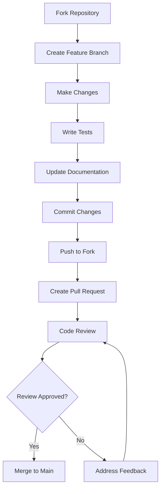

# Contributing Guide

## 🤝 Welcome Contributors

Thank you for your interest in contributing to the My Collection project! This document will guide you through the contribution process in an effective and professional manner.

## 📋 Table of Contents

1. [Code of Conduct](#code-of-conduct)
2. [How to Contribute](#how-to-contribute)
3. [Development Setup](#development-setup)
4. [Coding Standards](#coding-standards)
5. [Commit Guidelines](#commit-guidelines)
6. [Pull Request Process](#pull-request-process)
7. [Testing Requirements](#testing-requirements)
8. [Documentation](#documentation)
9. [Issue Reporting](#issue-reporting)
10. [Community](#community)

## 📜 Code of Conduct

### Our Commitment

We are committed to creating an open and friendly environment for everyone, regardless of:
- Age, gender, gender identity
- Disability, ethnicity, nationality
- Religion, politics
- Programming experience

### Encouraged Behavior

- Use friendly and inclusive language
- Respect different viewpoints and experiences
- Accept constructive feedback gracefully
- Focus on what is best for the community
- Show empathy towards other community members

### Unacceptable Behavior

- Use of sexualized language or imagery
- Trolling, insulting/derogatory comments
- Public or private harassment
- Publishing others' private information
- Other conduct inappropriate in a professional environment

## 🚀 How to Contribute

### Types of Contributions

1. **Bug Reports**: Report bugs and issues
2. **Feature Requests**: Propose new features
3. **Code Contributions**: Contribute code
4. **Documentation**: Improve documentation
5. **Testing**: Write and improve tests
6. **Design**: UI/UX improvements
7. **Translation**: Translation and i18n

### Contribution Process



## 🛠️ Development Setup

### Prerequisites

```bash
# Node.js (v18+)
node --version

# npm (v9+)
npm --version

# Git
git --version

# Docker (optional)
docker --version
```

### Local Development Setup

```bash
# 1. Fork and clone repository
git clone https://github.com/YOUR_USERNAME/my-collection.git
cd my-collection

# 2. Install dependencies
npm install

# 3. Setup environment variables
cp .env.example .env
# Edit .env with local information

# 4. Setup database
docker-compose up -d postgres redis

# 5. Run migrations
npm run migration:run

# 6. Seed database (optional)
npm run seed

# 7. Start development servers
npm run dev
```

### Development Scripts

```bash
# Frontend development
npm run ng:serve          # Angular dev server
npm run ng:build          # Build frontend
npm run ng:test           # Run frontend tests
npm run ng:lint           # Lint frontend code

# Backend development
npm run nest:start:dev    # NestJS dev server
npm run nest:build        # Build backend
npm run nest:test         # Run backend tests
npm run nest:lint         # Lint backend code

# Full stack
npm run dev               # Start both frontend & backend
npm run build             # Build entire application
npm run test              # Run all tests
npm run lint              # Lint all code
```

## 📝 Coding Standards

### TypeScript/JavaScript

```typescript
// ✅ Good
interface BookmarkCreateDto {
  title: string;
  url: string;
  description?: string;
  tags: string[];
  collectionId?: string;
}

class BookmarkService {
  async createBookmark(dto: BookmarkCreateDto): Promise<Bookmark> {
    // Implementation
  }
}

// ❌ Bad
interface bookmarkDto {
  title: any;
  url: any;
  desc: any;
  tags: any;
}

class bookmarkService {
  createBookmark(data: any): any {
    // Implementation
  }
}
```

### Angular Components

```typescript
// ✅ Good
@Component({
  selector: 'app-bookmark-card',
  templateUrl: './bookmark-card.component.html',
  styleUrls: ['./bookmark-card.component.scss'],
  changeDetection: ChangeDetectionStrategy.OnPush,
  standalone: true,
  imports: [CommonModule, RouterModule]
})
export class BookmarkCardComponent implements OnInit, OnDestroy {
  @Input() bookmark!: Bookmark;
  @Output() bookmarkClick = new EventEmitter<Bookmark>();
  
  private destroy$ = new Subject<void>();
  
  ngOnInit(): void {
    // Initialization logic
  }
  
  ngOnDestroy(): void {
    this.destroy$.next();
    this.destroy$.complete();
  }
  
  onBookmarkClick(): void {
    this.bookmarkClick.emit(this.bookmark);
  }
}
```

### NestJS Controllers

```typescript
// ✅ Good
@Controller('bookmarks')
@UseGuards(JwtAuthGuard)
@ApiTags('bookmarks')
export class BookmarkController {
  constructor(private readonly bookmarkService: BookmarkService) {}
  
  @Get()
  @ApiOperation({ summary: 'Get user bookmarks' })
  @ApiResponse({ status: 200, type: [BookmarkDto] })
  async findAll(
    @Query() query: BookmarkQueryDto,
    @CurrentUser() user: User
  ): Promise<BookmarkListResponseDto> {
    return this.bookmarkService.findAll(user.id, query);
  }
  
  @Post()
  @ApiOperation({ summary: 'Create new bookmark' })
  @ApiResponse({ status: 201, type: BookmarkDto })
  async create(
    @Body() createDto: CreateBookmarkDto,
    @CurrentUser() user: User
  ): Promise<BookmarkDto> {
    return this.bookmarkService.create(user.id, createDto);
  }
}
```

### CSS/SCSS

```scss
// ✅ Good - BEM methodology
.bookmark-card {
  display: flex;
  flex-direction: column;
  padding: 1rem;
  border-radius: 0.5rem;
  box-shadow: 0 2px 4px rgba(0, 0, 0, 0.1);
  
  &__header {
    display: flex;
    justify-content: space-between;
    align-items: center;
    margin-bottom: 0.5rem;
  }
  
  &__title {
    font-size: 1.125rem;
    font-weight: 600;
    color: var(--text-primary);
    
    &--truncated {
      overflow: hidden;
      text-overflow: ellipsis;
      white-space: nowrap;
    }
  }
  
  &__actions {
    display: flex;
    gap: 0.5rem;
  }
  
  &--favorite {
    border-left: 4px solid var(--color-primary);
  }
}

// ❌ Bad
.card {
  padding: 16px;
}

.title {
  font-size: 18px;
}

.btn {
  background: blue;
}
```

### Naming Conventions

```typescript
// Files and Directories
bookmark.service.ts           // Services
bookmark.component.ts         // Components
bookmark.dto.ts              // DTOs
bookmark.entity.ts           // Entities
bookmark.interface.ts        // Interfaces
bookmark.enum.ts             // Enums
bookmark.constant.ts         // Constants

// Classes
export class BookmarkService { }
export class BookmarkComponent { }
export class CreateBookmarkDto { }

// Interfaces
export interface Bookmark { }
export interface BookmarkQuery { }

// Enums
export enum BookmarkStatus { }

// Constants
export const BOOKMARK_CONSTANTS = { };

// Functions
export function createBookmark() { }
export function validateBookmarkUrl() { }

// Variables
const bookmarkList = [];
const isBookmarkValid = true;
const bookmarkCount = 10;
```

## 📝 Commit Guidelines

### Commit Message Format

```
<type>(<scope>): <subject>

<body>

<footer>
```

### Types

- **feat**: New feature
- **fix**: Bug fix
- **docs**: Documentation changes
- **style**: Formatting changes, missing semi colons, etc
- **refactor**: Code refactoring
- **test**: Adding or fixing tests
- **chore**: Maintenance tasks

### Examples

```bash
# Feature
feat(bookmarks): add bookmark sharing functionality

Add ability to share bookmarks with other users through email
or public links. Includes privacy settings and access controls.

Closes #123

# Bug fix
fix(auth): resolve JWT token expiration issue

Fixed issue where JWT tokens were not being refreshed properly,
causing users to be logged out unexpectedly.

Fixes #456

# Documentation
docs(api): update bookmark API documentation

Added examples for new bookmark endpoints and updated
response schemas.

# Refactor
refactor(components): extract common bookmark logic

Moved shared bookmark functionality to a base class to
reduce code duplication across components.
```

### Commit Best Practices

```bash
# ✅ Good commits
git commit -m "feat(bookmarks): add bulk delete functionality"
git commit -m "fix(ui): resolve mobile responsive issues"
git commit -m "docs(readme): update installation instructions"

# ❌ Bad commits
git commit -m "fix stuff"
git commit -m "update"
git commit -m "changes"
```

## 🔄 Pull Request Process

### Before Creating PR

1. **Sync with main branch**
```bash
git checkout main
git pull upstream main
git checkout feature/your-feature
git rebase main
```

2. **Run tests**
```bash
npm run test
npm run lint
npm run build
```

3. **Update documentation**
```bash
# Update relevant docs
# Add/update tests
# Update CHANGELOG.md if needed
```

### PR Template

```markdown
## Description
Brief description of changes made.

## Type of Change
- [ ] Bug fix (non-breaking change which fixes an issue)
- [ ] New feature (non-breaking change which adds functionality)
- [ ] Breaking change (fix or feature that would cause existing functionality to not work as expected)
- [ ] Documentation update

## Testing
- [ ] Unit tests pass
- [ ] Integration tests pass
- [ ] Manual testing completed
- [ ] Cross-browser testing (if UI changes)

## Screenshots (if applicable)
Add screenshots to help explain your changes.

## Checklist
- [ ] My code follows the style guidelines
- [ ] I have performed a self-review of my code
- [ ] I have commented my code, particularly in hard-to-understand areas
- [ ] I have made corresponding changes to the documentation
- [ ] My changes generate no new warnings
- [ ] I have added tests that prove my fix is effective or that my feature works
- [ ] New and existing unit tests pass locally with my changes

## Related Issues
Closes #(issue number)
```

### Review Process

1. **Automated Checks**
   - CI/CD pipeline passes
   - Code coverage maintained
   - No security vulnerabilities

2. **Code Review**
   - At least 1 reviewer approval
   - Address all feedback
   - Resolve all conversations

3. **Final Checks**
   - Rebase if needed
   - Squash commits if requested
   - Update PR description

## 🧪 Testing Requirements

### Test Coverage

```typescript
// Unit Tests - Services
describe('BookmarkService', () => {
  let service: BookmarkService;
  let repository: Repository<Bookmark>;

  beforeEach(async () => {
    const module = await Test.createTestingModule({
      providers: [
        BookmarkService,
        {
          provide: getRepositoryToken(Bookmark),
          useClass: Repository,
        },
      ],
    }).compile();

    service = module.get<BookmarkService>(BookmarkService);
    repository = module.get<Repository<Bookmark>>(getRepositoryToken(Bookmark));
  });

  describe('create', () => {
    it('should create a bookmark successfully', async () => {
      const createDto: CreateBookmarkDto = {
        title: 'Test Bookmark',
        url: 'https://example.com',
        tags: ['test']
      };

      const savedBookmark = { id: '1', ...createDto };
      jest.spyOn(repository, 'save').mockResolvedValue(savedBookmark as Bookmark);

      const result = await service.create('user1', createDto);

      expect(result).toEqual(savedBookmark);
      expect(repository.save).toHaveBeenCalledWith(
        expect.objectContaining(createDto)
      );
    });
  });
});
```

```typescript
// Component Tests
describe('BookmarkCardComponent', () => {
  let component: BookmarkCardComponent;
  let fixture: ComponentFixture<BookmarkCardComponent>;

  beforeEach(async () => {
    await TestBed.configureTestingModule({
      imports: [BookmarkCardComponent]
    }).compileComponents();

    fixture = TestBed.createComponent(BookmarkCardComponent);
    component = fixture.componentInstance;
    component.bookmark = mockBookmark;
    fixture.detectChanges();
  });

  it('should display bookmark title', () => {
    const titleElement = fixture.debugElement.query(By.css('.bookmark-card__title'));
    expect(titleElement.nativeElement.textContent).toBe(mockBookmark.title);
  });

  it('should emit bookmarkClick when clicked', () => {
    spyOn(component.bookmarkClick, 'emit');
    
    const cardElement = fixture.debugElement.query(By.css('.bookmark-card'));
    cardElement.nativeElement.click();
    
    expect(component.bookmarkClick.emit).toHaveBeenCalledWith(mockBookmark);
  });
});
```

### E2E Tests

```typescript
// e2e/bookmarks.e2e-spec.ts
describe('Bookmarks E2E', () => {
  test('should create and display new bookmark', async ({ page }) => {
    await page.goto('/bookmarks');
    
    // Click add bookmark button
    await page.click('[data-testid="add-bookmark-btn"]');
    
    // Fill form
    await page.fill('[data-testid="bookmark-title"]', 'Test Bookmark');
    await page.fill('[data-testid="bookmark-url"]', 'https://example.com');
    
    // Submit form
    await page.click('[data-testid="save-bookmark-btn"]');
    
    // Verify bookmark appears in list
    await expect(page.locator('[data-testid="bookmark-item"]')).toContainText('Test Bookmark');
  });
});
```

## 📚 Documentation

### Code Documentation

```typescript
/**
 * Service for managing user bookmarks
 * 
 * @example
 * ```typescript
 * const bookmark = await bookmarkService.create(userId, {
 *   title: 'Example',
 *   url: 'https://example.com'
 * });
 * ```
 */
@Injectable()
export class BookmarkService {
  /**
   * Creates a new bookmark for the specified user
   * 
   * @param userId - The ID of the user creating the bookmark
   * @param createDto - The bookmark data
   * @returns Promise resolving to the created bookmark
   * 
   * @throws {BadRequestException} When URL is invalid
   * @throws {ConflictException} When bookmark already exists
   */
  async create(userId: string, createDto: CreateBookmarkDto): Promise<Bookmark> {
    // Implementation
  }
}
```

### API Documentation

```typescript
@ApiOperation({
  summary: 'Create a new bookmark',
  description: 'Creates a new bookmark for the authenticated user. The URL will be validated and metadata will be automatically extracted.'
})
@ApiResponse({
  status: 201,
  description: 'Bookmark created successfully',
  type: BookmarkDto
})
@ApiResponse({
  status: 400,
  description: 'Invalid URL or validation error'
})
@ApiResponse({
  status: 409,
  description: 'Bookmark with this URL already exists'
})
async create(@Body() createDto: CreateBookmarkDto) {
  // Implementation
}
```

## 🐛 Issue Reporting

### Bug Report Template

```markdown
**Bug Description**
A clear and concise description of what the bug is.

**To Reproduce**
Steps to reproduce the behavior:
1. Go to '...'
2. Click on '....'
3. Scroll down to '....'
4. See error

**Expected Behavior**
A clear and concise description of what you expected to happen.

**Screenshots**
If applicable, add screenshots to help explain your problem.

**Environment:**
 - OS: [e.g. iOS]
 - Browser [e.g. chrome, safari]
 - Version [e.g. 22]
 - Node.js version
 - npm version

**Additional Context**
Add any other context about the problem here.
```

### Feature Request Template

```markdown
**Is your feature request related to a problem? Please describe.**
A clear and concise description of what the problem is. Ex. I'm always frustrated when [...]

**Describe the solution you'd like**
A clear and concise description of what you want to happen.

**Describe alternatives you've considered**
A clear and concise description of any alternative solutions or features you've considered.

**Additional context**
Add any other context or screenshots about the feature request here.
```

## 🏷️ Labels and Workflow

### Issue Labels

- **Type**
  - `bug` - Something isn't working
  - `enhancement` - New feature or request
  - `documentation` - Improvements or additions to documentation
  - `question` - Further information is requested

- **Priority**
  - `priority: high` - Critical issues
  - `priority: medium` - Important issues
  - `priority: low` - Nice to have

- **Status**
  - `status: needs-triage` - Needs initial review
  - `status: in-progress` - Currently being worked on
  - `status: blocked` - Blocked by external dependency
  - `status: ready-for-review` - Ready for code review

- **Area**
  - `area: frontend` - Angular/UI related
  - `area: backend` - NestJS/API related
  - `area: database` - Database related
  - `area: deployment` - CI/CD, Docker, etc.

## 🌟 Recognition

### Contributors

We recognize all contributions in:

1. **README.md** - Contributors section
2. **CHANGELOG.md** - Release notes
3. **GitHub Releases** - Release descriptions
4. **All Contributors** bot

### Types of Contributions

- 💻 Code
- 📖 Documentation
- 🐛 Bug reports
- 💡 Ideas
- 🤔 Answering Questions
- ⚠️ Tests
- 🎨 Design
- 🌍 Translation

## 📞 Getting Help

### Communication Channels

1. **GitHub Issues** - Bug reports, feature requests
2. **GitHub Discussions** - General questions, ideas
3. **Discord** - Real-time chat (link in README)
4. **Email** - maintainers@my-collection.com

### Response Times

- **Bug reports**: 24-48 hours
- **Feature requests**: 1 week
- **Pull requests**: 2-3 days
- **Questions**: 24 hours

## 🎯 Roadmap

### Current Focus Areas

1. **Performance Optimization**
   - Database query optimization
   - Frontend bundle size reduction
   - Caching improvements

2. **User Experience**
   - Mobile responsiveness
   - Accessibility improvements
   - Keyboard navigation

3. **Features**
   - Advanced search
   - Bookmark sharing
   - Import/export improvements

### How to Contribute to Roadmap

1. Check existing issues and discussions
2. Create feature request with detailed proposal
3. Participate in community discussions
4. Vote on existing proposals

---

**Thank you for contributing to My Collection! 🚀**

**Last Updated**: 2024-12-19  
**Version**: 1.0.0  
**Author**: My Collection Team