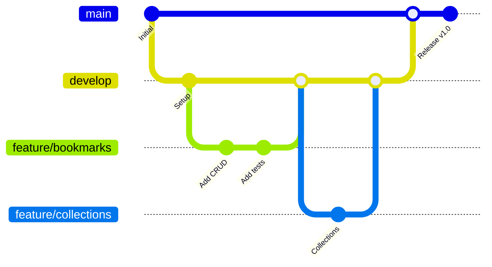

# My Collection - Project Overview

## 📋 Table of Contents

1. [Introduction](#introduction)
2. [Project Goals](#project-goals)
3. [Overall Architecture](#overall-architecture)
4. [Technologies and Tools](#technologies-and-tools)
5. [Key Features](#key-features)
6. [Project Structure](#project-structure)
7. [Development Process](#development-process)
8. [Roadmap](#roadmap)
9. [Metrics and KPIs](#metrics-and-kpis)

## 🎯 Introduction

My Collection is a modern web application designed to help users manage bookmarks efficiently and organizationally. The project is built with the goal of creating a comprehensive solution for storing, categorizing, and searching important web links.

### 🌟 Vision

To become the leading bookmark management platform with a user-friendly interface, rich features, and high performance, helping users optimize their web browsing experience.

### 🎯 Mission

To provide a powerful and easy-to-use tool for organizing, managing, and sharing bookmarks, helping users save time and improve work efficiency.

## 🎯 Project Goals

### Short-term Goals (3-6 months)
- ✅ Complete core features (CRUD bookmark, collections, tags)
- ✅ Deploy authentication and authorization
- ✅ Build responsive UI with dark/light mode
- ✅ Implement import/export from browser
- 🚧 Optimize performance and SEO
- 🚧 Complete test coverage (80%+)

### Medium-term Goals (6-12 months)
- 📋 Develop sharing and collaboration features
- 📋 Build browser extension
- 📋 Implement advanced search with AI
- 📋 Integrate social features
- 📋 Mobile app (React Native)
- 📋 API rate limiting and monitoring

### Long-term Goals (1-2 years)
- 📋 Machine learning for recommendations
- 📋 Enterprise features (team management, analytics)
- 📋 Multi-language support
- 📋 Offline capabilities
- 📋 Advanced analytics dashboard
- 📋 Third-party integrations

## 🏗️ Overall Architecture

### High-Level Architecture

```
┌─────────────────┐    ┌─────────────────┐    ┌─────────────────┐
│   Frontend      │    │    Backend      │    │   Database      │
│   (Angular)     │◄──►│   (NestJS)      │◄──►│  (PostgreSQL)   │
│                 │    │                 │    │                 │
│ • Components    │    │ • Controllers   │    │ • Tables        │
│ • Services      │    │ • Services      │    │ • Indexes       │
│ • State Mgmt    │    │ • Guards        │    │ • Constraints   │
│ • Routing       │    │ • Interceptors  │    │ • Triggers      │
└─────────────────┘    └─────────────────┘    └─────────────────┘
         │                       │                       │
         │              ┌─────────────────┐              │
         │              │     Redis       │              │
         └──────────────►│   (Caching)     │◄─────────────┘
                        │                 │
                        │ • Sessions      │
                        │ • Cache         │
                        │ • Rate Limiting │
                        └─────────────────┘
```

### Detailed Architecture

```
Frontend (Angular 20+)
├── Core Module
│   ├── Authentication Service
│   ├── HTTP Interceptors
│   ├── Guards (Auth, Role)
│   └── Error Handling
├── Shared Module
│   ├── UI Components (Spartan)
│   ├── Pipes & Directives
│   ├── Utilities
│   └── Types/Interfaces
├── Feature Modules
│   ├── Bookmarks
│   ├── Collections
│   ├── Tags
│   ├── User Profile
│   └── Settings
└── State Management (NgRx Signals)
    ├── Bookmark Store
    ├── Collection Store
    ├── Tag Store
    └── User Store

Backend (NestJS)
├── Authentication Module
│   ├── JWT Strategy
│   ├── Guards
│   └── Decorators
├── Core Modules
│   ├── Bookmarks
│   ├── Collections
│   ├── Tags
│   ├── Users
│   └── Search
├── Common Module
│   ├── Database Config
│   ├── Redis Config
│   ├── Validation Pipes
│   ├── Exception Filters
│   └── Interceptors
└── Infrastructure
    ├── Database (TypeORM)
    ├── Caching (Redis)
    ├── File Storage
    └── External APIs
```

## 🛠️ Technologies and Tools

### Frontend Stack

| Technology | Version | Purpose | Reason for Choice |
|-----------|-----------|----------|----------------|
| **Angular** | 20+ | Main framework | Modern, TypeScript-first, Standalone Components |
| **NgRx Signals** | Latest | State management | Reactive, type-safe, modern approach |
| **Spartan UI** | Latest | Component library | Radix primitives, accessible, customizable |
| **Tailwind CSS** | 3.4+ | Styling | Utility-first, responsive, maintainable |
| **TypeScript** | 5.0+ | Programming language | Type safety, better DX, scalability |
| **Vite** | Latest | Build tool | Fast HMR, optimized builds |

### Backend Stack

| Technology | Version | Purpose | Reason for Choice |
|-----------|-----------|----------|----------------|
| **NestJS** | 10+ | Main framework | Scalable, modular, TypeScript-native |
| **TypeORM** | 0.3+ | ORM | Type-safe, migrations, relationships |
| **PostgreSQL** | 15+ | Primary database | ACID, JSON support, performance |
| **Redis** | 7+ | Caching & sessions | In-memory, pub/sub, clustering |
| **JWT** | Latest | Authentication | Stateless, secure, scalable |
| **Swagger** | Latest | API documentation | Auto-generated, interactive |

### DevOps & Tools

| Technology | Purpose | Reason for Choice |
|-----------|----------|----------------|
| **Docker** | Containerization | Consistent environments, easy deployment |
| **GitHub Actions** | CI/CD | Integrated, free for public repos |
| **Terraform** | Infrastructure as Code | Declarative, version-controlled |
| **Jest** | Unit testing | Fast, snapshot testing, mocking |
| **Playwright** | E2E testing | Cross-browser, reliable, modern |
| **ESLint/Prettier** | Code quality | Consistent formatting, best practices |

## ✨ Key Features

### 🔖 Bookmark Management

```typescript
interface BookmarkFeatures {
  crud: {
    create: 'Add bookmark with automatic metadata';
    read: 'View details with preview';
    update: 'Edit information and tags';
    delete: 'Delete with confirmation';
  };
  
  organization: {
    collections: 'Group bookmarks by topic';
    tags: 'Flexible tagging';
    favorites: 'Mark as favorites';
    folders: 'Folder structure';
  };
  
  search: {
    fullText: 'Full-text search';
    filters: 'Filter by tags, collections, date';
    suggestions: 'Smart suggestions';
    advanced: 'Advanced search with operators';
  };
}
```

### 👤 User Management

```typescript
interface UserFeatures {
  authentication: {
    register: 'Register with email verification';
    login: 'Login with JWT';
    socialAuth: 'Google, GitHub OAuth';
    twoFactor: '2FA with TOTP';
  };
  
  profile: {
    settings: 'Personal settings';
    preferences: 'Interface preferences';
    privacy: 'Privacy settings';
    export: 'Export personal data';
  };
  
  collaboration: {
    sharing: 'Share bookmarks/collections';
    teams: 'Team collaboration';
    permissions: 'Detailed permissions';
    activity: 'Activity tracking';
  };
}
```

### 📱 User Interface

```typescript
interface UIFeatures {
  responsive: {
    mobile: 'Mobile optimized';
    tablet: 'Tablet interface';
    desktop: 'Full desktop experience';
  };
  
  themes: {
    light: 'Light mode';
    dark: 'Dark mode';
    auto: 'System preference';
    custom: 'Custom color schemes';
  };
  
  accessibility: {
    keyboard: 'Keyboard navigation';
    screenReader: 'Screen reader support';
    highContrast: 'High contrast mode';
    fontSize: 'Font size customization';
  };
}
```

## 📁 Project Structure

### Directory Organization

```
my-collection/
├── 📁 src/
│   ├── 📁 app/                     # Angular application
│   │   ├── 📁 core/               # Core services & guards
│   │   │   ├── 📁 auth/           # Authentication logic
│   │   │   ├── 📁 guards/         # Route guards
│   │   │   ├── 📁 interceptors/   # HTTP interceptors
│   │   │   └── 📁 services/       # Core services
│   │   ├── 📁 shared/             # Shared components
│   │   │   ├── 📁 components/     # Reusable components
│   │   │   ├── 📁 pipes/          # Custom pipes
│   │   │   ├── 📁 directives/     # Custom directives
│   │   │   └── 📁 utils/          # Utility functions
│   │   ├── 📁 features/           # Feature modules
│   │   │   ├── 📁 bookmarks/      # Bookmark management
│   │   │   ├── 📁 collections/    # Collection management
│   │   │   ├── 📁 tags/           # Tag management
│   │   │   ├── 📁 profile/        # User profile
│   │   │   └── 📁 settings/       # Application settings
│   │   └── 📁 layouts/            # Layout components
│   └── 📁 backend/                # NestJS backend
│       ├── 📁 auth/               # Authentication module
│       ├── 📁 bookmarks/          # Bookmark module
│       ├── 📁 collections/        # Collection module
│       ├── 📁 tags/               # Tag module
│       ├── 📁 users/              # User module
│       ├── 📁 search/             # Search module
│       └── 📁 common/             # Shared backend code
├── 📁 docs/                       # Documentation
│   ├── 📁 api/                    # API documentation
│   ├── 📁 frontend/               # Frontend docs
│   ├── 📁 backend/                # Backend docs
│   └── 📁 deployment/             # Deployment guides
├── 📁 e2e/                        # End-to-end tests
├── 📁 docker/                     # Docker configurations
├── 📁 scripts/                    # Build & deployment scripts
└── 📁 tools/                      # Development tools
```

### Naming Conventions

```typescript
// Files & Folders
interface NamingConventions {
  files: {
    components: 'kebab-case.component.ts';
    services: 'kebab-case.service.ts';
    modules: 'kebab-case.module.ts';
    interfaces: 'kebab-case.interface.ts';
  };
  
  folders: {
    features: 'kebab-case';
    shared: 'kebab-case';
    assets: 'kebab-case';
  };
  
  classes: {
    components: 'PascalCase + Component suffix';
    services: 'PascalCase + Service suffix';
    interfaces: 'PascalCase + Interface suffix';
    types: 'PascalCase + Type suffix';
  };
  
  variables: {
    properties: 'camelCase';
    constants: 'UPPER_SNAKE_CASE';
    functions: 'camelCase';
    methods: 'camelCase';
  };
}
```

## 🔄 Development Process

### Git Workflow



### Branch Strategy

```typescript
interface BranchStrategy {
  main: {
    purpose: 'Production-ready code';
    protection: 'Require PR + reviews';
    deployment: 'Auto deploy to production';
  };
  
  develop: {
    purpose: 'Integration branch';
    source: 'Feature branches merge here';
    deployment: 'Auto deploy to staging';
  };
  
  feature: {
    naming: 'feature/feature-name';
    source: 'Branch from develop';
    lifecycle: 'Delete after merge';
  };
  
  hotfix: {
    naming: 'hotfix/issue-description';
    source: 'Branch from main';
    target: 'Merge to main & develop';
  };
}
```

### Code Review Process

```typescript
interface CodeReviewProcess {
  requirements: {
    minReviewers: 2;
    requiredChecks: ['tests', 'lint', 'build'];
    blockingIssues: ['security', 'performance', 'breaking-changes'];
  };
  
  checklist: [
    'Code follows style guidelines',
    'Tests are included and passing',
    'Documentation is updated',
    'No security vulnerabilities',
    'Performance impact considered',
    'Backward compatibility maintained'
  ];
  
  automation: {
    linting: 'ESLint + Prettier';
    testing: 'Jest + Playwright';
    security: 'Snyk + CodeQL';
    coverage: 'Codecov';
  };
}
```

## 🗺️ Roadmap

### Phase 1: Foundation (Q1 2024) ✅
- [x] Project setup and architecture
- [x] Core bookmark CRUD operations
- [x] Basic authentication system
- [x] Responsive UI with Spartan UI
- [x] Database schema and migrations
- [x] Basic testing setup

### Phase 2: Core Features (Q2 2024) ✅
- [x] Collections management
- [x] Tag system
- [x] Search functionality
- [x] Import/export from browser
- [x] User profile management
- [x] Dark/light theme

### Phase 3: Enhancement (Q3 2024) 🚧
- [ ] Advanced search with filters
- [ ] Bookmark sharing
- [ ] Performance optimization
- [ ] Comprehensive testing
- [ ] API documentation
- [ ] Deployment automation

### Phase 4: Advanced Features (Q4 2024) 📋
- [ ] Browser extension
- [ ] Social features
- [ ] Team collaboration
- [ ] Analytics dashboard
- [ ] Mobile app (React Native)
- [ ] AI-powered recommendations

### Phase 5: Enterprise (Q1 2025) 📋
- [ ] Enterprise features
- [ ] Advanced analytics
- [ ] Multi-language support
- [ ] Offline capabilities
- [ ] Third-party integrations
- [ ] White-label solutions

## 📊 Metrics and KPIs

### Technical Metrics

```typescript
interface TechnicalMetrics {
  performance: {
    pageLoadTime: '< 2s';
    apiResponseTime: '< 500ms';
    firstContentfulPaint: '< 1.5s';
    cumulativeLayoutShift: '< 0.1';
  };
  
  quality: {
    testCoverage: '> 80%';
    codeQuality: 'A grade (SonarQube)';
    securityScore: '> 95%';
    accessibility: 'WCAG 2.1 AA';
  };
  
  reliability: {
    uptime: '> 99.9%';
    errorRate: '< 0.1%';
    mttr: '< 1 hour';
    deploymentFrequency: 'Daily';
  };
}
```

### Business Metrics

```typescript
interface BusinessMetrics {
  user: {
    activeUsers: 'Monthly/Daily active users';
    retention: '7-day, 30-day retention rates';
    engagement: 'Session duration, pages per session';
    satisfaction: 'NPS score, user feedback';
  };
  
  feature: {
    adoption: 'Feature usage rates';
    bookmarkCount: 'Average bookmarks per user';
    searchUsage: 'Search queries per session';
    sharing: 'Bookmark sharing frequency';
  };
  
  growth: {
    signups: 'New user registrations';
    conversion: 'Trial to paid conversion';
    churn: 'User churn rate';
    referrals: 'Referral program effectiveness';
  };
}
```

### Monitoring & Alerting

```typescript
interface MonitoringSetup {
  infrastructure: {
    tools: ['Prometheus', 'Grafana', 'AlertManager'];
    metrics: ['CPU', 'Memory', 'Disk', 'Network'];
    alerts: ['High CPU', 'Memory leak', 'Disk full'];
  };
  
  application: {
    tools: ['Sentry', 'LogRocket', 'New Relic'];
    metrics: ['Error rate', 'Response time', 'Throughput'];
    alerts: ['Error spike', 'Performance degradation'];
  };
  
  business: {
    tools: ['Google Analytics', 'Mixpanel', 'Hotjar'];
    metrics: ['User behavior', 'Conversion funnel', 'Feature usage'];
    alerts: ['Drop in signups', 'High churn rate'];
  };
}
```

## 🎯 Success Criteria

### Technical Success
- ✅ Scalable architecture supporting 10k+ concurrent users
- ✅ Sub-second response times for all API endpoints
- ✅ 99.9% uptime with automated failover
- ✅ Comprehensive test coverage (80%+ unit, 70%+ integration)
- ✅ Security best practices implementation
- ✅ Accessible UI (WCAG 2.1 AA compliance)

### Business Success
- 📋 10,000+ registered users in first year
- 📋 70%+ user retention after 30 days
- 📋 Average 50+ bookmarks per active user
- 📋 4.5+ star rating in app stores
- 📋 Positive ROI within 18 months
- 📋 Recognition in developer community

### User Success
- 📋 Intuitive onboarding (< 5 minutes to first bookmark)
- 📋 Fast bookmark import from existing browsers
- 📋 Efficient search and organization features
- 📋 Seamless cross-device synchronization
- 📋 Reliable backup and export capabilities
- 📋 Responsive customer support

---

## 📞 Project Contact

- **Project Manager**: [Name](mailto:pm@my-collection.com)
- **Tech Lead**: [Name](mailto:tech@my-collection.com)
- **Product Owner**: [Name](mailto:product@my-collection.com)
- **Repository**: [GitHub](https://github.com/your-username/my-collection)
- **Documentation**: [Docs Site](https://docs.my-collection.com)

---

*This document is updated regularly to reflect the current state of the project.*